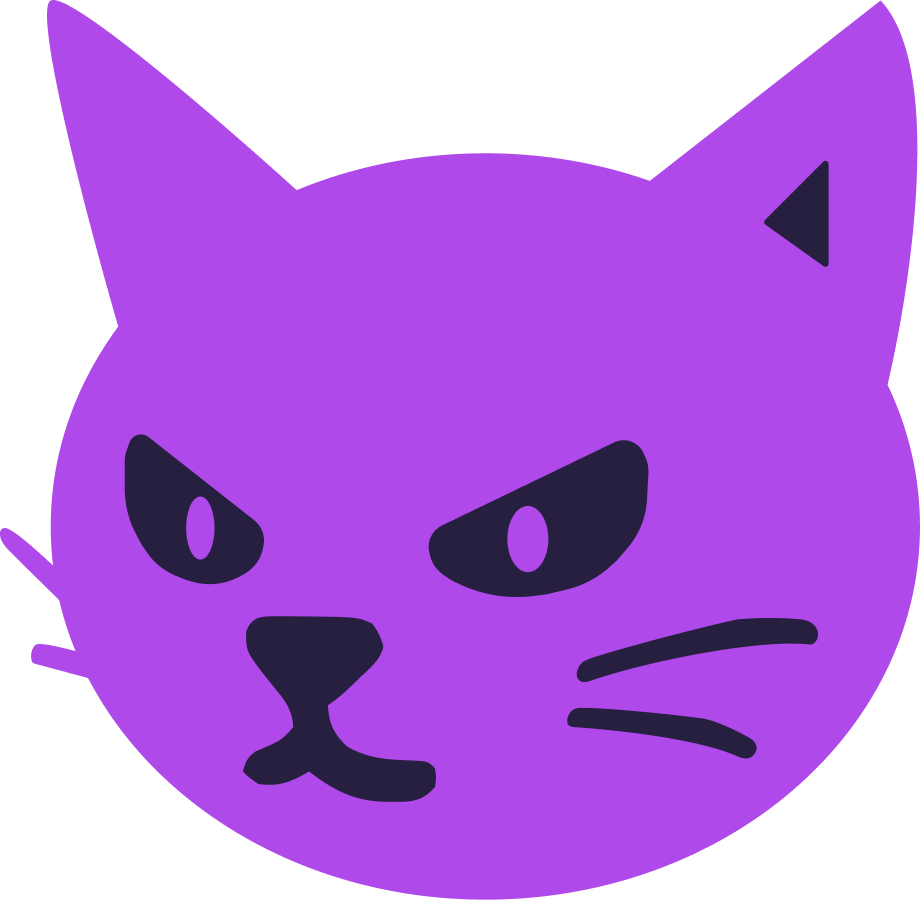
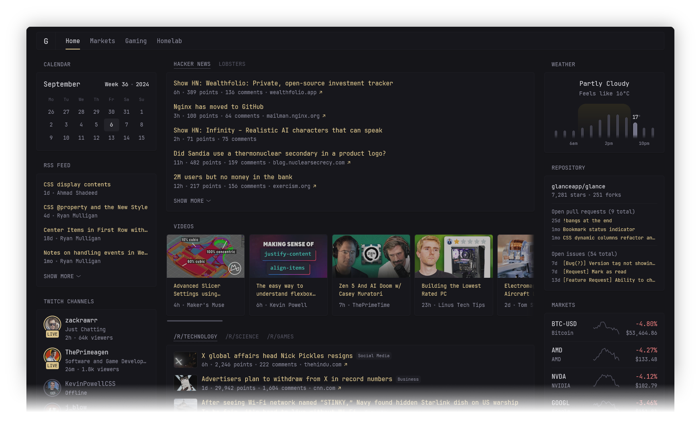
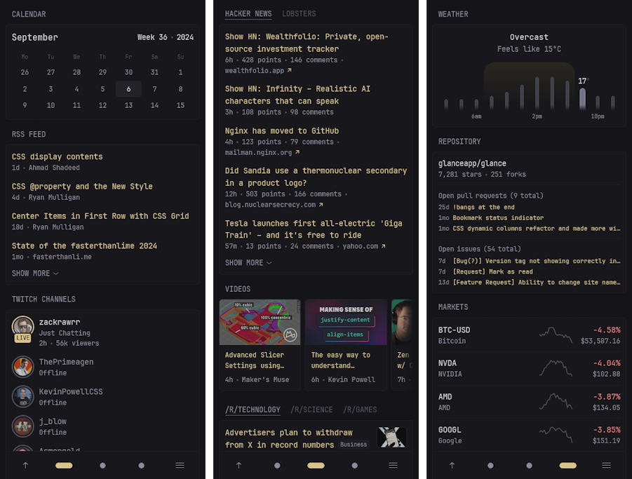

<p align="center"></p>
<h1 align="center">Dynacat</h1>
<p align="center">
  <a href="https://dynacat.artur.zone/configuration">Configuration</a> •
  <a href="https://discord.gg/mUqTzrfjFP">Discord</a> •
  <a href="https://www.paypal.com/paypalme/imartur">Sponsor</a> 
</p>
<p align="center">
  <a href="https://github.com/glanceapp/community-widgets">Glance Community widgets</a> •
  <a href="https://dynacat.artur.zone/preconfigured-pages">Preconfigured pages</a> •
  <a href="https://dynacat.artur.zone/themes">Themes</a> 
</p>

<p align="center">A glance fork that is focused on dynamic updates<br>and easy app integration without the need of writing your own widget's.</p>



## Features
### Various widgets
* RSS feeds
* Subreddit posts
* Hacker News posts
* Weather forecasts
* YouTube channel uploads
* Twitch channels
* Market prices
* Docker containers status
* Server stats
* Custom widgets
* [and many more...](https://dynacat.artur.zone/configuration#configuring-dynacat)

### Fast and lightweight
* Low memory usage
* Few dependencies
* Minimal vanilla JS
* Single <20mb binary available for multiple OSs & architectures and just as small Docker container
* Uncached pages usually load within ~1s (depending on internet speed and number of widgets)

### Tons of customizability
* Different layouts
* As many pages/tabs as you need
* Numerous configuration options for each widget
* Multiple styles for some widgets
* Custom CSS

### Optimized for mobile devices
Because you'll want to take it with you on the go.



### Themeable
Easily create your own theme by tweaking a few numbers or choose from one of the [already available themes](https://dynacat.artur.zone/themes).


<br>

## Configuration
Configuration is done through YAML files, to learn more about how the layout works, how to add more pages and how to configure widgets, visit the [configuration documentation](https://dynacat.artur.zone/configuration#configuring-dynacat).

<details>
<summary><strong>Preview example configuration file</strong></summary>
<br>

```yaml
  - name: Home
    columns:
      - size: small
        widgets:
          - type: calendar
            first-day-of-week: monday

          - type: rss
            limit: 10
            collapse-after: 3
            cache: 12h
            feeds:
              - url: https://selfh.st/rss/
                title: selfh.st
                limit: 4
              - url: https://ciechanow.ski/atom.xml
              - url: https://www.joshwcomeau.com/rss.xml
                title: Josh Comeau
              - url: https://samwho.dev/rss.xml
              - url: https://ishadeed.com/feed.xml
                title: Ahmad Shadeed

          - type: twitch-channels
            channels:
              - theprimeagen
              - j_blow
              - piratesoftware
              - cohhcarnage
              - christitustech
              - EJ_SA

      - size: full
        widgets:
          - type: group
            widgets:
              - type: hacker-news
              - type: lobsters

          - type: videos
            channels:
              - UCXuqSBlHAE6Xw-yeJA0Tunw # Linus Tech Tips
              - UCR-DXc1voovS8nhAvccRZhg # Jeff Geerling
              - UCsBjURrPoezykLs9EqgamOA # Fireship
              - UCBJycsmduvYEL83R_U4JriQ # Marques Brownlee
              - UCHnyfMqiRRG1u-2MsSQLbXA # Veritasium

          - type: group
            widgets:
              - type: reddit
                subreddit: technology
                show-thumbnails: true
              - type: reddit
                subreddit: selfhosted
                show-thumbnails: true

      - size: small
        widgets:
          - type: weather
            location: London, United Kingdom
            units: metric
            hour-format: 12h

          - type: markets
            markets:
              - symbol: SPY
                name: S&P 500
              - symbol: BTC-USD
                name: Bitcoin
              - symbol: NVDA
                name: NVIDIA
              - symbol: AAPL
                name: Apple
              - symbol: MSFT
                name: Microsoft

          - type: releases
            cache: 1d
            repositories:
              - panonim/dynacat
              - go-gitea/gitea
              - immich-app/immich
              - syncthing/syncthing
```
</details>

## Common issues
<details>
<summary><strong>Requests timing out</strong></summary>

The most common cause of this is when using Pi-Hole, AdGuard Home or other ad-blocking DNS services, which by default have a fairly low rate limit. Depending on the number of widgets you have in a single page, this limit can very easily be exceeded. To fix this, increase the rate limit in the settings of your DNS service.

If using Podman, in some rare cases the timeout can be caused by an unknown issue, in which case it may be resolved by adding the following to the bottom of your `docker-compose.yml` file:
```yaml
networks:
  podman:
    external: true
```
</details>

<details>
<summary><strong>Broken layout for markets, bookmarks or other widgets</strong></summary>

This is almost always caused by the browser extension Dark Reader. To fix this, disable dark mode for the domain where Dynacat is hosted.
</details>

<details>
<summary><strong>cannot unmarshal !!map into []dynacat.page</strong></summary>

The most common cause of this is having a `pages` key in your `dynacat.yml` and then also having a `pages` key inside one of your included pages. To fix this, remove the `pages` key from the top of your included pages.

</details>

<br>

<div style='text-align: center;'>

**If you like this project, please consider [sponsoring](https://www.paypal.com/paypalme/imartur).**

<a href="https://www.star-history.com/?repos=panonim%2Fdynacat&type=date&legend=bottom-right">
 <picture>
   <source media="(prefers-color-scheme: dark)" srcset="https://api.star-history.com/image?repos=panonim/dynacat&type=date&theme=dark&legend=bottom-right" />
   <source media="(prefers-color-scheme: light)" srcset="https://api.star-history.com/image?repos=panonim/dynacat&type=date&legend=bottom-right" />
   
 </picture>
</a>
</div>

> This is a fork of a ['Glance'](https://github.com/glanceapp/glance) dashboard. 
